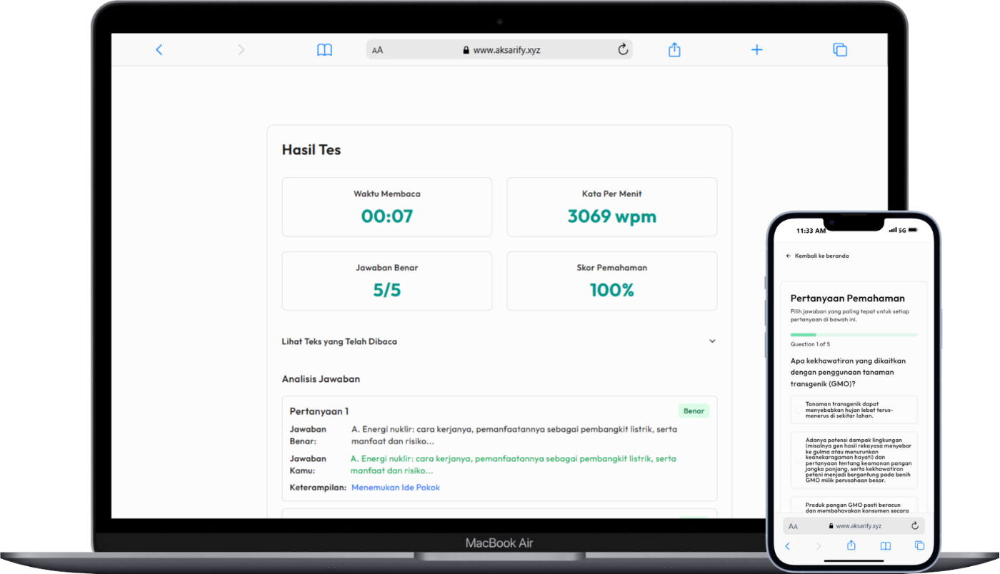

# Aksarify - Platform Uji Pemahaman Bacaan

<p align="center">
  
</p>

<p align="center">
  <strong>Uji dan tingkatkan pemahaman bacaan Bahasa Indonesia dalam hitungan menit!</strong>
</p>

## 📖 Tentang Aksarify

Aksarify adalah platform interaktif yang dirancang untuk membantu pengguna mengukur dan meningkatkan kemampuan pemahaman bacaan Bahasa Indonesia. Dengan metode tes yang efektif dan menyenangkan, Aksarify menawarkan pengalaman belajar yang menarik untuk semua tingkat pembaca.

## 🚀 Fitur Utama

- **Tes Kilat** - Satu teks (~200 kata) dan 5 soal pilihan ganda, selesai dalam hitungan menit
- **Beragam Tingkat Kesulitan** - Tersedia tes dengan berbagai level kesulitan
- **Analisis Instan** - Dapatkan hasil dan pembahasan segera setelah menyelesaikan tes
- **Metrik Performa** - Lacak kecepatan membaca, kata per menit, dan tingkat pemahaman
- **Antarmuka Modern** - Pengalaman pengguna yang intuitif dan responsif

## 🧪 Demo

Kunjungi [https://www.aksarify.xyz](https://www.aksarify.xyz) untuk mencoba Aksarify.

## 🛠️ Teknologi

Aksarify dibangun dengan stack teknologi modern:

- **Framework**: [Next.js 15](https://nextjs.org/) dengan App Router
- **Database**: [PostgreSQL](https://www.postgresql.org/) dengan [Prisma ORM](https://prisma.io/)
- **Styling**: [Tailwind CSS](https://tailwindcss.com/) dengan [Shadcn UI](https://ui.shadcn.com/)
- **Backend**: [tRPC](https://trpc.io/) untuk API type-safe
- **Deployment**: Dioptimalkan untuk [Vercel](https://vercel.com/)

## 💻 Instalasi dan Pengembangan Lokal

### Prasyarat

- Node.js (versi 18 atau lebih tinggi)
- PostgreSQL
- pnpm, npm, yarn, atau bun

### Langkah Instalasi

1. Clone repositori
   ```bash
   git clone https://github.com/rizkraf/aksarify.git
   cd aksarify
   ```

2. Install dependencies
   ```bash
   pnpm install
   # atau
   npm install
   ```

3. Salin file environment dan sesuaikan
   ```bash
   cp .env.example .env
   # Edit file .env dengan editor pilihan Anda
   ```

4. Siapkan database
   ```bash
   pnpm prisma migrate dev
   # atau
   npx prisma migrate dev
   ```

5. Jalankan seed untuk sampel data (opsional)
   ```bash
   pnpm prisma db seed
   # atau
   npx prisma db seed
   ```

6. Jalankan aplikasi dalam mode development
   ```bash
   pnpm dev
   # atau
   npm run dev
   ```

7. Buka [http://localhost:3000](http://localhost:3000) di browser Anda

## 📚 Struktur Aplikasi

```
src/
├── app/                   # Next.js App Router
│   ├── api/               # API routes
│   ├── result/            # Halaman hasil tes
│   ├── test/              # Halaman ujian
├── components/            # React components
│   ├── result/            # Komponen hasil
│   ├── test/              # Komponen ujian
│   └── ui/                # Komponen UI umum
├── hooks/                 # Custom React hooks
├── lib/                   # Utilitas & helper
├── server/                # Backend logic & tRPC
│   └── api/               # tRPC API routes
└── styles/                # Global styles
```
